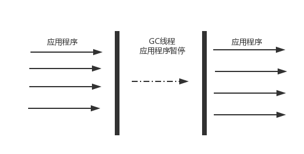
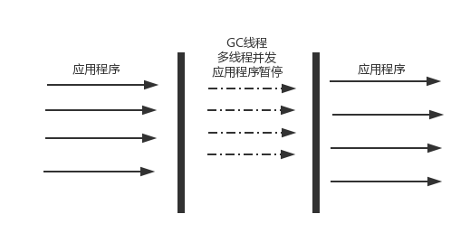
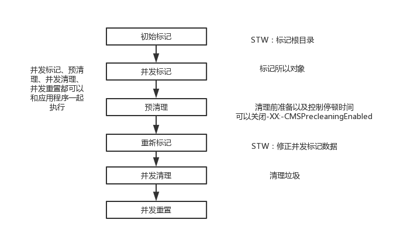

# 串行垃圾回收器
串行垃圾回收器 是使用单线程进行垃圾回收的回收器。每次回收时，只有一个工作线程，适用于并行能力弱的计算机。串行回收器`专注性`和`独占性`往往有更好的性能表现。
<!--more-->
* `-XX:+UseSerialGC`：新生代、老年代都是用串行回收器
* `-XX:+UseParNewGC`:新生代使用ParNew回收器，老年代是使用串行回收器
* `-XX:+UseParallelGC`:新生代使用ParallelGC回收器，老年代使用串行回收器.



## 新生代串行回收器
主要有两个特点：
* 它仅仅使用单线程进行垃圾回收
* 它是独占式的垃圾回收

在串行收集器回收垃圾时，Java应用程序的线程都需要暂停，等待垃圾回收完成。

新生代串行回收器使用`复制算法`,在硬件不是很优越的环境中可能性能优于并行回收器和并发回收器
## 老年代串行回收器
老年代串行回收算法是使用的`标记压缩算法`.它是串行的独占式的垃圾回收器。老年代串行回收器启动，一般STW（Stop-the-world）会更加的长.(可作为CMS回收器的备用回收器)


# 并行回收器
并行回收器在串行的基础上进行了改进，使用了`多线程`进行垃圾回收。可以缩小垃圾回收所需的实际时间。


* `-XX:+UseParNewGC`：新生代使用ParNew回收器，老年代是使用串行回收器
* `-XX:+UseConcMarkSweepGC`:新生代使用ParNew回收器,老年代使用CMS回收器
* 
## 新生代ParNew回收器
parNew是工作在新生代的垃圾回收器，它只是简单的`将串行回收器多线程化`，回收策略、算法、参数等与新生代串行回收器相同.在并行能力较强的CPU上，停顿时简要短于串行回收器。

在工作时可以使用`-XX:ParallelGCThreads`参数指定线程数量.默认情况下：当cpu小于8个时，ParallelGCThreads=CPU数;当cpu>8时，ParallelGCThreads = 3+(5*CPU_NUMBER)/8.

## 新生代ParallelGC回收器
新生带ParallelGC回收器也是`复制算法`、`多线程`、`独占式`.ParallelGC非常关注系统的吞吐量.

有以下ParallelGC几个参数可以使用
* `-XX:+UseParallelGC`：新生代使用ParallelGC回收器，老年代是使用串行回收器
* `-XX:+UseParallelOldGC`:新生代使用ParallelGC回收器，老年代是使用ParallelOldGC回收器
* `-XX:MaxGCPauseMillis`：`设置最大垃圾回收时间`大于0的整数。
* `-XX:GCTimeRatio`:`设置吞吐量大小`0-100的值。用户设置系统垃圾回收和正常工作的时间。如果GCTimeRatio=n,系统将花不超过1/(1+N)的时间用于垃圾回收.系统默认n = 19 则系统将用不超过5%的时间来垃圾回收
* `-XX:+UseAdaptiveSizePolicy`:`打开自适应GC策略`，该模式下 新生代大小、eden和survivor的比例、晋升老年代的对象年龄等参数都会自动的调整.目的是：`达到堆大小、吞吐量和停顿时间之间的平衡点`。让虚拟机可以自己完成调优工作。

## 老年代ParallelOldGC回收器
在老年代使用的Parallel回收器（多线程并发）。和新生代一样关注系统的吞吐量。

使用的是`标记压缩算法`(JDK1.6及以后才能使用)。
```
[Full GC [PSYoungGen(使用新生代ParallelGC回收器): 1000K->71K(1024K)] [ParOldGen(使用老年代ParallelOldGC回收器): 508K->460K(512K)] 1508K->532K(1536K), [Metaspace: 2597K->2597K(1056768K)], 0.0057408 secs] [Times: user=0.02 sys=0.00, real=0.01 secs] 

```

设置参数也在新生代Parallel中讨论过
* `-XX:+UseParallelOldGC`：在新生代使用ParallelGC回收器,在老年代使用ParallelOldGC回收器.(这会非常关注系统的吞吐量)
* `-XX:ParallelGCThreads`:设置线程数（在上一个小结有说明）

# CMS回收器(Concurrent Mark Sweep)
并发标记清理，主要关注系统的停顿时间。使用`标记清除算法` 同时使用`多线程并行`的回收垃圾回收器。
## 工作步骤
主要步骤有：`初始标记`,`并发标记`,`预清理`,`重新标记`,`并发清理`,`并发重置`.接下来我画个图说明他们主要工作。

在初始标记和重新标记两个部分需要停顿。预处理是并发的，预处理会刻意的等待一次新生代的GC发生后，然后根据历史数据预测下一次的新生代GC可以能发生的时间，在中间时刻进行重新标记，避免新生代GC和重新标记重合，尽量减少一次停顿时间。
## 主要配置参数
## 日志分析
## 清理永久代的Class回收
